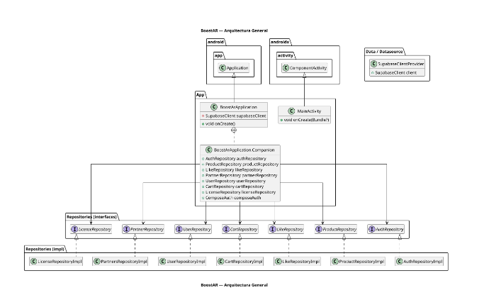
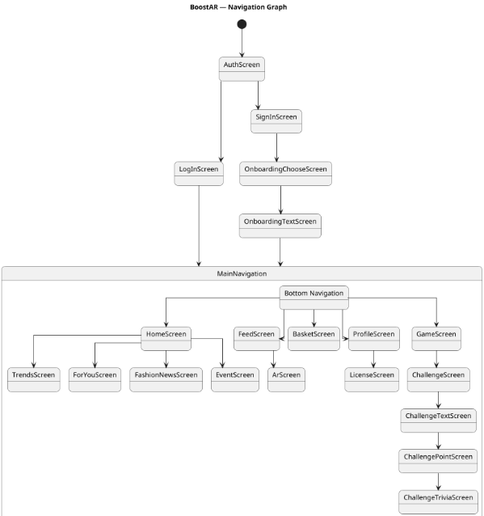
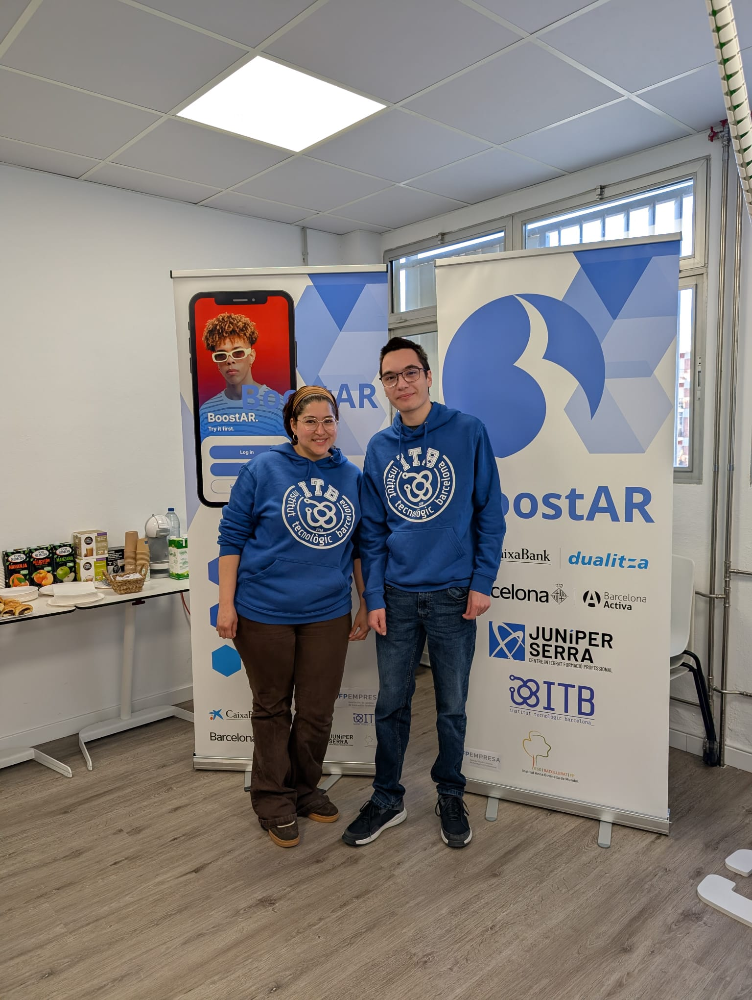

# Boostar 

> 
> **"Pruébate el futuro"** 
>

---
**Boostar** es una aplicación móvil de comercio electrónico de ropa que integra tecnologías de **realidad aumentada (AR)** para transformar la experiencia de compra online. La aplicación permite a los usuarios visualizar cómo les quedaría una prenda antes de comprarla mediante un sistema virtual de "Try It On".

---

## 📋 Resumen del Proyecto

* **Problema que soluciona**: Reduce la gran cantidad de dinero perdido en devoluciones al permitir que el cliente vea cómo le queda la ropa antes de la compra.

* **Propósito**: Actuar como un e-commerce interactivo que mejora la confianza del usuario final.

Aquí tienes la sección del **Core Tecnológico** actualizada con los badges (escudos) correspondientes para que tu README luzca mucho más profesional y visual:

---

### 🛠️ Core Tecnológico

#### Mobile Development
*  
*  
* 

#### Realidad Aumentada (AR)
* 

#### Backend & Infrastructure
*  
*  
*  
##  Arquitectura de la App

El desarrollo sigue el patrón **MVVM (Modelo-Vista-ViewModel)**, separando el código en tres capas principales:

1. **Interfaz de Usuario**: Construida con **Jetpack Compose** bajo una mentalidad de *System Design* y componentes reutilizables.

2. **ViewModel**: Cada pantalla gestiona su propio estado y llamadas al repositorio.

3. **Repositorios**: Se utilizan interfaces para abstraer la fuente de datos, permitiendo intercambiar implementaciones entre Supabase y repositorios *mock* para pruebas.

## 📊 Base de Datos y Backend

El sistema gestiona una base de datos relacional compleja que incluye:

* **Productos**: Tablas vinculadas a marcas, estilos, colores, tallas y elementos multimedia (imágenes/videos).

* **Usuarios**: Clasificados en dos roles principales: **Clientes** (con carrito e historial) y **Empresas** (con productos asociados).

* **Endpoints clave**: Gestión de onboarding, filtrado de productos (`get_products`), gestión de likes (`toggle_like`) y perfiles de partners.

##  Flujo de la Aplicación

##  Estado del Proyecto y Mejoras

* **Bugs conocidos**: Problemas de persistencia en la paginación al volver de la pantalla AR y carga lenta de la Home en dispositivos de bajo rendimiento.

* **Mejoras pendientes**: Optimización del consumo de datos en videos y desarrollo completo de la funcionalidad del carrito.

---

## Video Demostrativo App

---

##  Autores

* **Marc Díaz Seuma** 

* **Michelle Carolina Posligua Contreras** 

* **Institución**: Institut Tecnològic Barcelona (ITB) 

* **Fecha**: 12/05/2026

